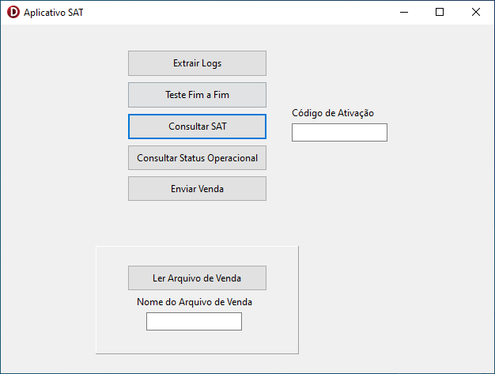

# Leia-me #

Este exemplo implementa um aplicativo simples para comunicação com o S@T-iD. Para executá-lo, tenha certeza de obter a versão mais recente da DLL do SAT no [site da Control iD](https://www.controlid.com.br/suporte/satid/sat_dll.php) e colocá-la em um diretório adequado.

Para utilizar esse exemplo, utilize a versão mais recente da biblioteca contida em SAT_vx.x.x.x/win32/libsatid.dll. Para a versão contida na pasta **win32_stdcall** é necessário usar 32 bit STDCALL na chamada. Não utilizar a DLL de **win32_stdcall** neste exemplo sem as modificações necessárias.

O exemplo implementa as funções ExtraisLogs, ConsultarStatusOperacioinal, TesteFimaFim, ConsultarSat e EnviarDadosVenda. Para o funcionamento correto, insira o __código de ativação__ do equipamento no campo indicado. 

Para verificar o exemplo de enviar dados de uma venda, insira o nome do arquivo que contém o _CFe_ de venda e pressione o botão adequado para carregar.

O retorno de cada função é exibido em uma mensagem.

Uma imagem de aplicação é visível abaixo.

